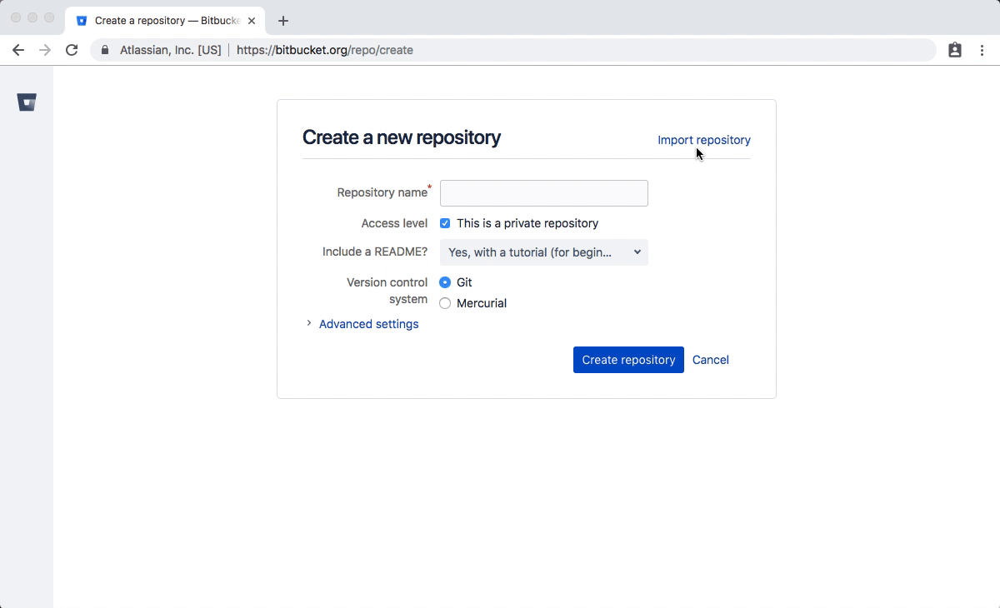
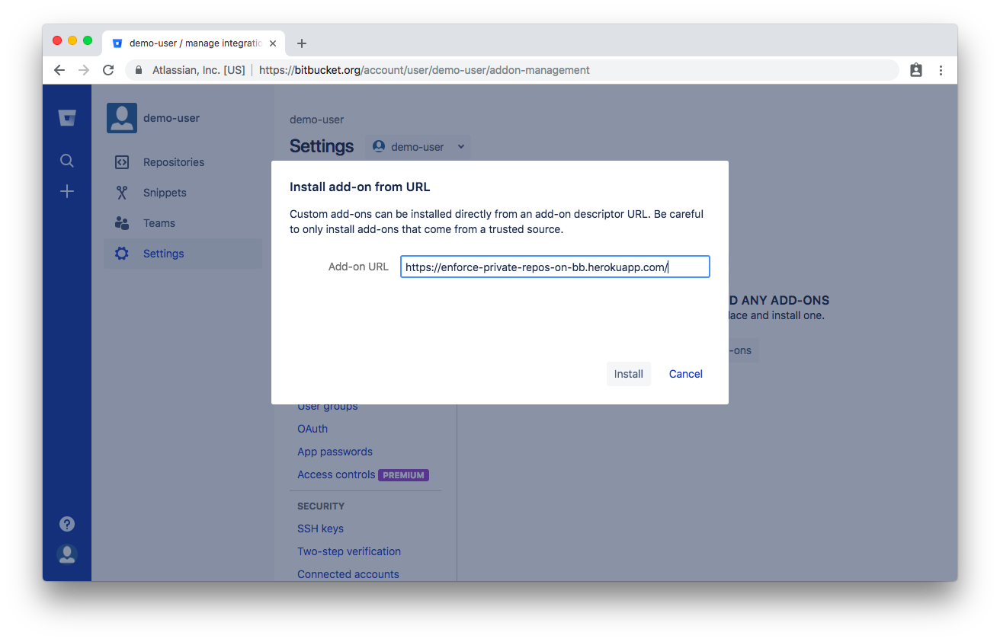

# Enforce Private Repos on BitBucket

> "BitBucket Cloud add-on" that enforces new repositories to be private

## The Problem

Humans make mistakes, sometimes we forget to mark a repository as private when we first create it.

This can lead to all of our source code being accidentally published publicly on the internet for a few months before anyone notices. (Yep, this happened!)

## This Solution

This project is a micro-service that works by listening for events within your BitBucket account. Specifically, it looks for the `repo:created` event. Once this service gets a notification, it will check the `is_private` attribute and if it’s `false` then it will update it to `true`. That’s literally it.

## Install

1. Visit https://bitbucket.org/account/addon-management
1. Click "Install add-on from URL"
1. Enter `https://enforce-private-repos-on-bb.herokuapp.com/` into the input field
1. Click the "Install" button

## Beware

This add-on is "Set it and forget it". With that said, keep in mind that this service _only_ works when creating a brand new project. It doesn't prevent someone from manually setting the visibility to public in the future.

---

### Developer Notes

These are here for my future self or anyone looking to contribute and get caught up with BitBucket Cloud.

- [BitBucket Cloud add-ons](https://confluence.atlassian.com/bitbucket/bitbucket-cloud-add-ons-780871938.html)
- [Integrating with BitBucket Cloud](https://developer.atlassian.com/cloud/bitbucket/integrating-with-bitbucket-cloud/?utm_source=%2Fbitbucket%2Fguides%2Fintroduction.html)

---

## Credits

- Logo background sampled from [AS15-99-13488](https://www.flickr.com/photos/47222633@N05/33353663734)
- Logomark by [Gregor Cresnar](https://thenounproject.com/term/lock/969546/)

## License

MIT
